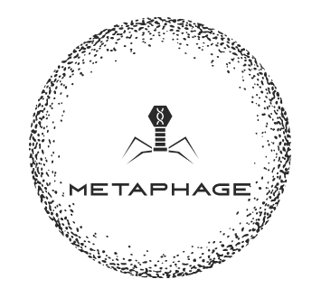

# MetaPhage v2 *beta*

> This release replaced VirSorter with VirSorter 2 and VirFinder with DeepVirfinder.
> It is currently being finalized, and only supports **conda** environments to provide dependencies,
> whilte the v1 branch supports Docker and Singularity as well.

  

This is MetaPhage, a nextflow pipeline for automatic phage discovery. MetaPhage can be run on Linux or MacOS.

## Documentation

:page: [Tutorial to use this *beta* version](tutorial_beta.md)
:book: MetaPhage documentation is [available online](https://MattiaPandolfoVR.github.io/MetaPhage/)

## Overview

This pipeline consists of several modules, as summarised in the workflow below.

  

