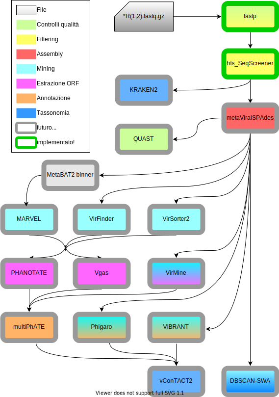

This is MetaPhage, a nextflow pipeline for phage discovery. MetaPhage can be run on Linux or MacOS.

# Installation

## With Conda

1. Conda is a handy package manager. First of all, install Conda following these instructions https://docs.conda.io/projects/conda/en/latest/user-guide/install/.

2. Open your terminal, create a new Conda environment named `nf` and activate it:
```
conda create --name nf
conda activate nf
```

3. Install Python:
```
conda install python==3.7.8 -c conda-forge
```

4. Install nextflow:
```
conda install nextflow==20.10.0 -c bioconda
```

## With Docker

Not implemented yet.

## With Singularity (recommended)

Not implemented yet.

# Usage

## With Conda

1. First of all, either copy your paired datasets in the `datasets/base` folder or specify the path where they are stored with the `--readPaths` option (see below).

2. Open your terminal and activate the environment previously created:
```
conda activate nf
```

3. Using `cd` command, set your working directory to the previously downloaded MetaPhage folder:
```
cd /your/path/MetaPhage
```

4. Start the pipeline with the following command:
```
nextflow run main.nf -profile base
```
At this level you can specify all your custom options, for example the `--readPaths` option previously mentioned:
```
nextflow run main.nf -profile base --readPath /your/path/
```


# Structure

This pipeline consists of several modules. The image below summarizes them all.

<p align="center">
  
</p>
