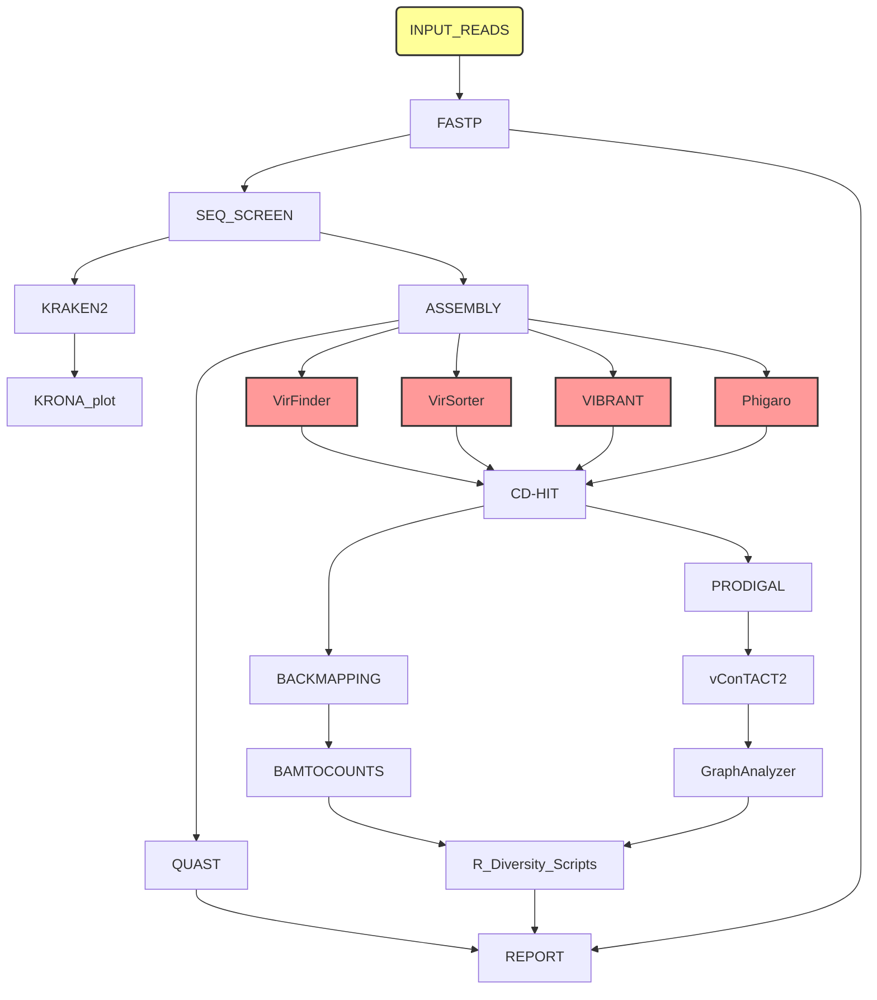

# MetaPhage dependencies

To ensure the reproducibility of results, a conda environment YAML
file is provided to:

1. Generate the conda environment
2. Generate a Docker/Singularity container based on the conda environment

The environment contains all the tools used in the pipeline and Nextflow itself:

 

