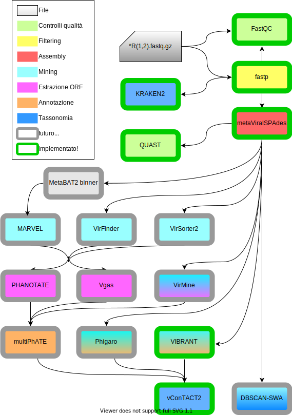
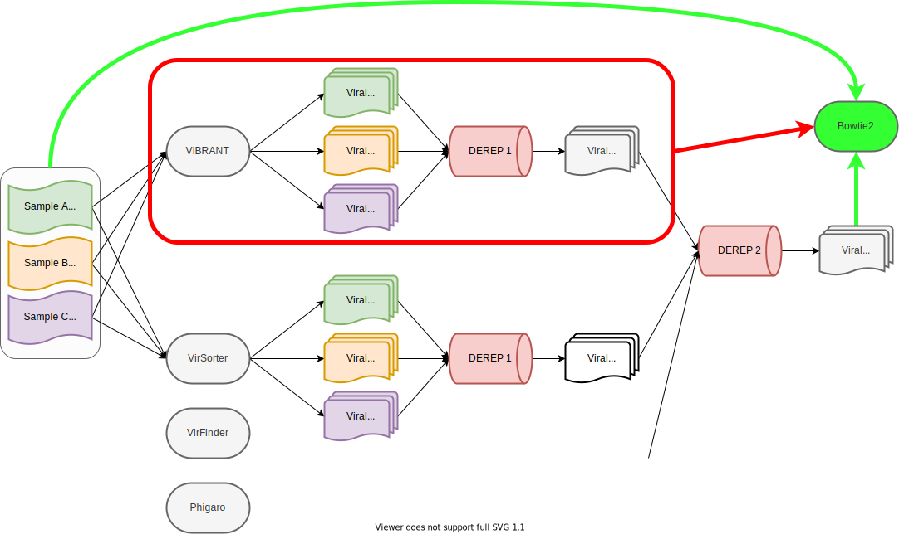
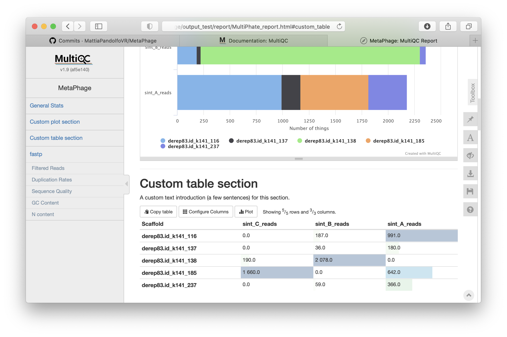
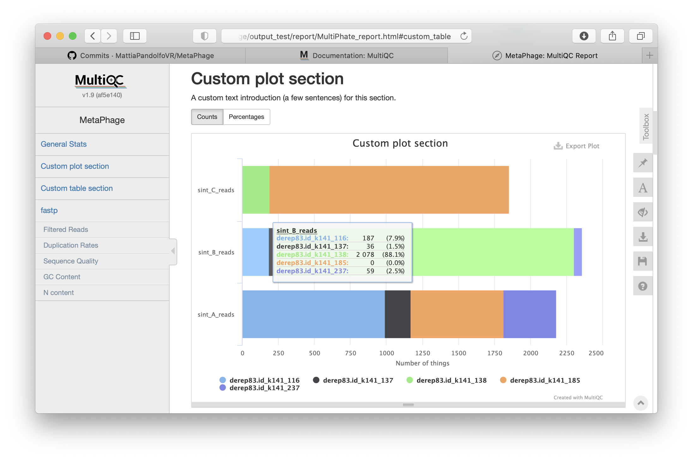
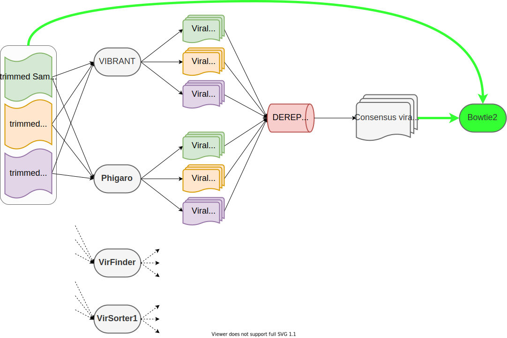

<!-- _class: lead -->
<!-- _footer: https://github.com/MattiaPandolfoVR/MetaPhage -->

# **MetaPhage**

A nextflow pipeline 
for phage discovery :smile:

---

### Update **12 october**

:white_check_mark: minimal pipeline working

running at Quadram:
:x: databases to be manually downloaded 
:x: absoluth paths everywhere
:x: conda packages to be manually installed

---

### Update **18 november**

:white_check_mark: only relative paths
:white_check_mark: auto-installed conda packages
:white_check_mark: wiki manual under development
:white_check_mark: **auto-handled dbs**
:x: no Docker/Singularity support

:exclamation: nf-core template removed

---

### **TO-DO on december-january**

:x: complete miners implementation (virFinder & virSorter)
:x: clusterizzation -> discuss with Evelyin!
:x: count matrixes (seq e prot)
:x: output magaement ?
:x: start the paper draft 
:x: complete the wiki
:x: MultiQC implementation!

---

### Update **december**

:cry: lost!

---

### Update **15 january**

:white_check_mark: binning implemented (maxbin2/metabat2/das_tool)
:white_check_mark: all conded miners are implemented
:white_check_mark: paper draft writing started
:x: still no Docker/Singularity support

---

### Update **15 january**

:white_check_mark: "proto" dereplication with CD-HIT (only Vibrant)
:construction: vConTACT2 has to run only once, with dereplication results!

---

### Update **15 gennaio**

:white_check_mark: bowtie2 vcs (viral consensus scaffolding)
:white_check_mark: MultiQC count matrix creation!

---

### Update **15 gennaio**

:white_check_mark: MultiQC counts barplot creation!

---

### Update **21 January**

:white_check_mark: dereplication now includes Vibrant, Phigaro, VirSorter1, VirFinder and Marvel

---

### Update **21 January**

:white_check_mark: rough dereplication with CD-HIT